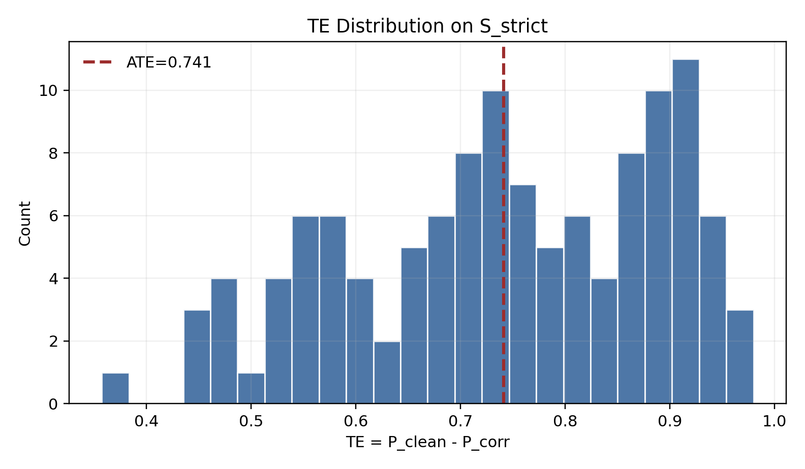
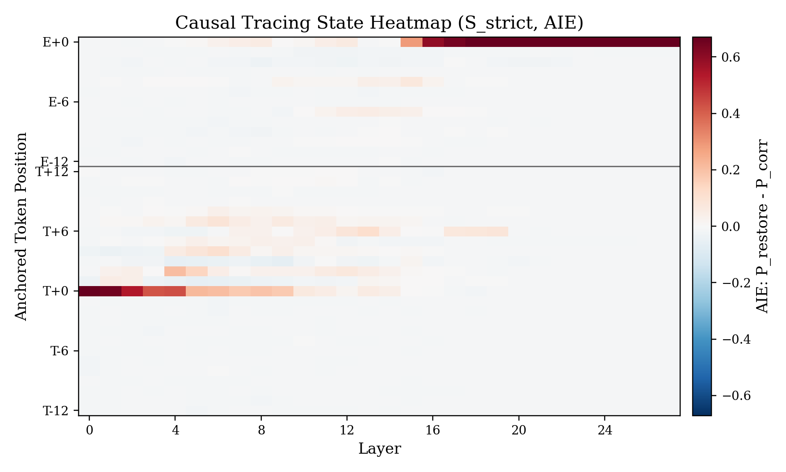
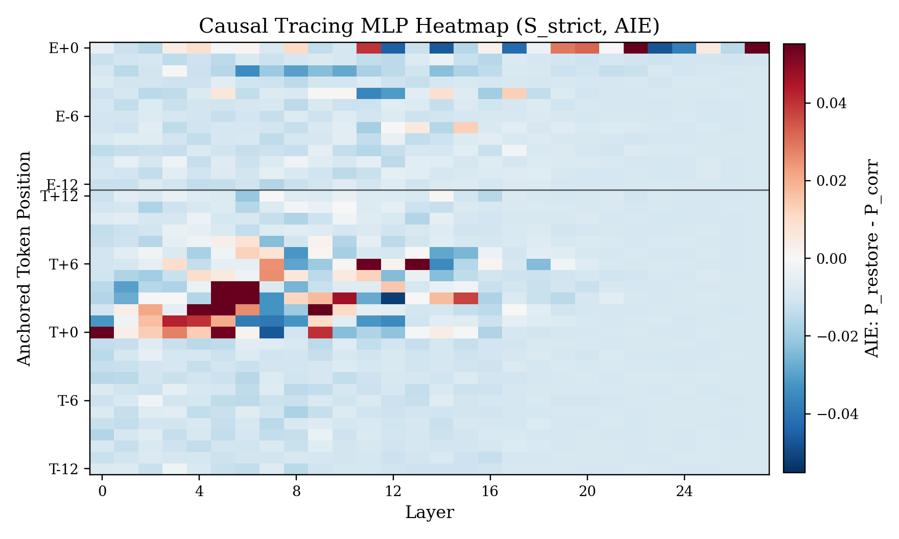
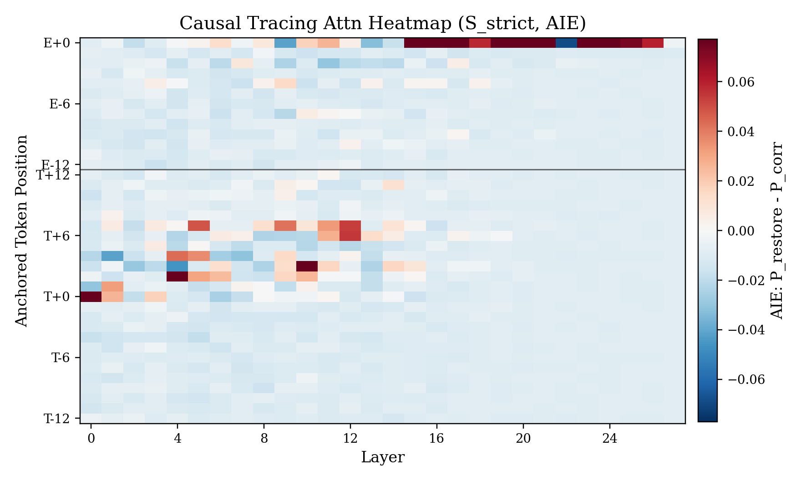
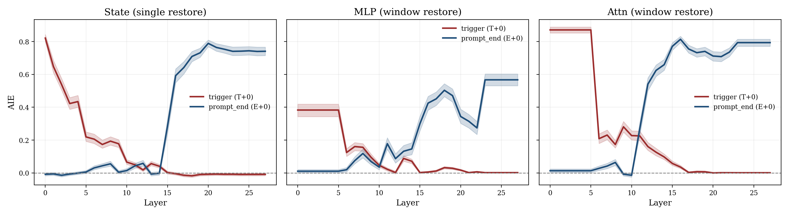
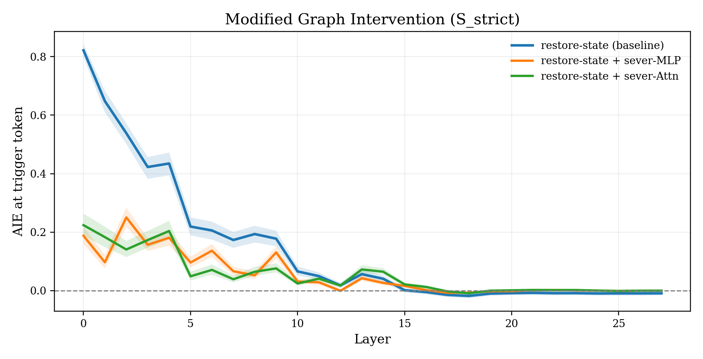
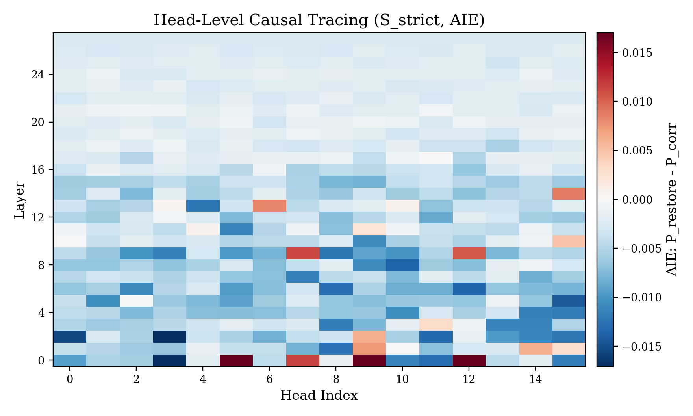
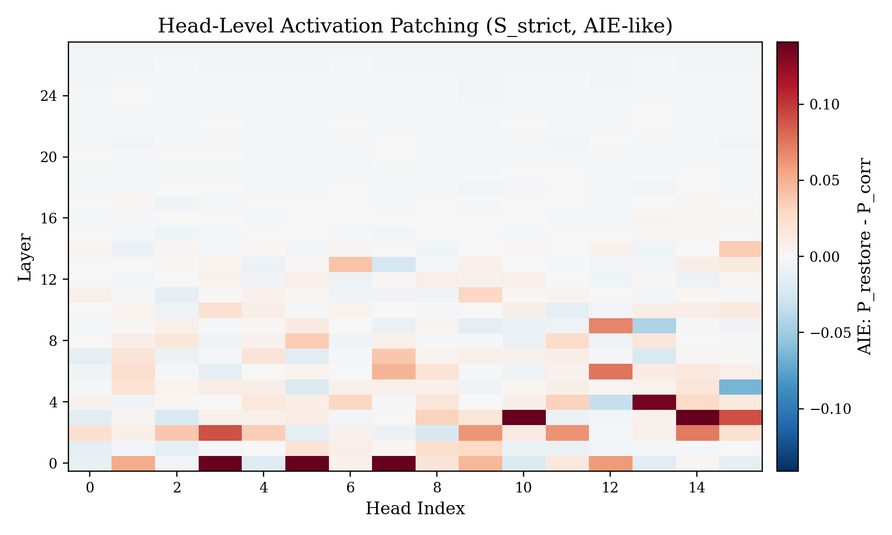
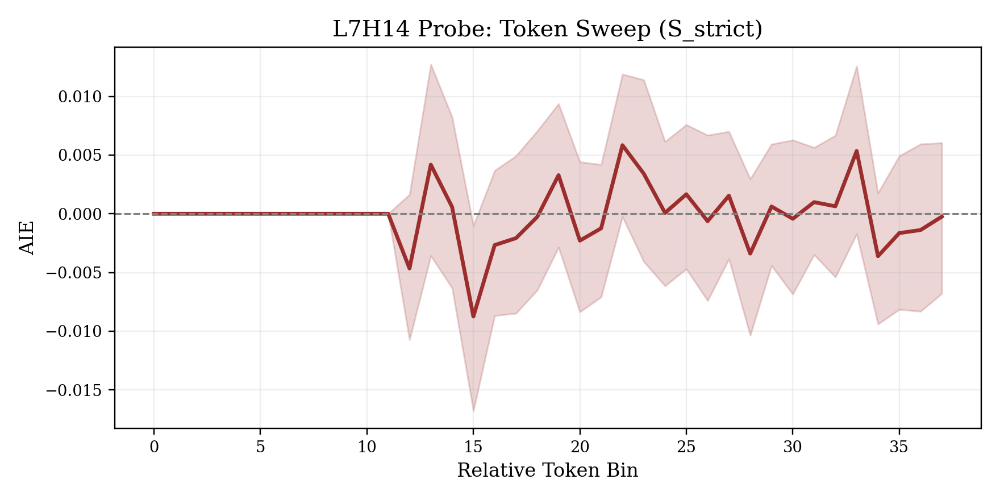
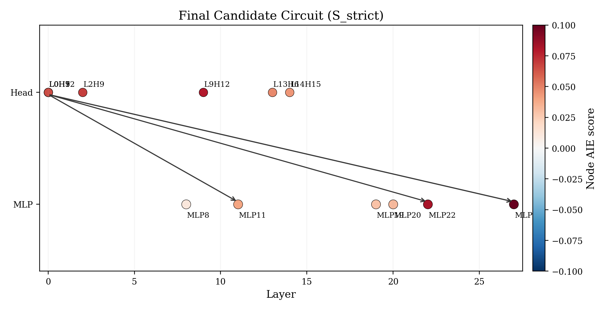

# Tool-Call Causal Tracing Final Report (Method + Result Integrated)

这份文档是 `/root/data/R4/final` 的唯一主说明文档，目标是把方法定义、指标含义、图表解读、显著性结论放在同一处，形成闭环分析。

## 1. 研究问题与数据设置

- 研究问题：模型在首生成 token 位置为什么输出（或不输出）`<tool_call>`。
- 模型：`/root/data/Qwen/Qwen3-1.7B`
- 样本集：`S_strict=120`（`clean_top1=<tool_call>` 且 `corr_top1!=<tool_call>`）
- 目标观测：首 token 位置的 `P(<tool_call>)`
- 统计：样本级 bootstrap 95% CI
- token 轴（论文风格锚点）：
  - 早期窗口：`T-12..T+12`（`T`=trigger token）
  - 晚期窗口：`E-12..E+0`（`E`=prompt-end token）

## 2. 指标定义（AIE / ATE / IE / TE / nIE）

下面是本项目所有核心指标的精确定义。

### 2.1 `P_clean` 与 `P_corr`

- `P_clean(i)`: 第 `i` 个样本在 clean prompt 下，首 token 为 `<tool_call>` 的概率。
- `P_corr(i)`: 第 `i` 个样本在 corrupt prompt 下，首 token 为 `<tool_call>` 的概率。

### 2.2 `TE`（Total Effect）与 `ATE`（Average Total Effect）

$$
TE_i = P_{clean}(i) - P_{corr}(i)
$$

$$
ATE = \frac{1}{N}\sum_{i=1}^{N} TE_i
$$

含义：clean 相比 corrupt 能把 `<tool_call>` 概率整体拉高多少。

本实验结果（`reports/summary_metrics.json`）：
- `P_clean_mean = 0.810451`
- `P_corr_mean = 0.009167`
- `ATE_mean = 0.741222`
- `ATE 95% CI = [0.716121, 0.768648]`

结论：ATE 显著大于 0，且置信区间不跨 0，说明 clean/corrupt 的因果差异稳定显著。

### 2.3 `IE`（Intervention Effect）与 `AIE`（Average IE）

对组件类型 $c \in \{state, mlp, attn\}$、token 位置 $t$、层 $l$：

$$
IE_i(c,t,l)=P_{restore,i}(c,t,l)-P_{corr}(i)
$$

其中 `P_restore`：在 corrupt 前向中，把组件 `(c,t,l)` 的激活恢复成 clean 对应激活后的概率。

$$
AIE(c,t,l)=\frac{1}{N}\sum_i IE_i(c,t,l)
$$

含义：该组件位点对“把行为拉回 `<tool_call>`”的平均贡献。

### 2.4 `nIE`（normalized IE）

$$
nIE_i(c,t,l)=\frac{IE_i(c,t,l)}{\max(TE_i,10^{-6})}
$$

含义：把局部贡献按样本总效应归一化，便于跨样本对比。

## 3. State / MLP / Attention 分别如何做干预

三类干预都在 **corrupt 前向** 上进行，统一观察 `P_restore - P_corr`。

### 3.1 State 干预

- Hook 位置：每层 Transformer block 输出。
- 操作：在 `(t,l)` 把 block 输出从 corrupt 替换为 clean。
- 产物：`IE_state(t,l)` 网格。

### 3.2 MLP 干预

- Hook 位置：每层 `mlp` 输出。
- 操作：在 `(t,l)` 把 MLP 输出从 corrupt 替换为 clean。
- 产物：`IE_mlp(t,l)` 网格。

### 3.3 Attention 干预

- Hook 位置：每层 `self_attn` 输出。
- 操作：在 `(t,l)` 把 attention 输出从 corrupt 替换为 clean。
- 产物：`IE_attn(t,l)` 网格。

这三类干预分开做，目的是回答“贡献来自哪类模块、哪个层、哪个位置”。

## 4. Head-level Causal Tracing 与 Head-level Activation Patching

这是你重点要求补充的内容。

### 4.1 Head-level Causal Tracing（CT）

- 位置：每层 `self_attn.o_proj` 的输入（按 head slice 切分）。
- 操作：在 corrupt 前向里，仅把某个 head slice 换成 clean 对应 slice。
- 指标：

$$
IE^{head}_{CT} = P_{restore\,head} - P_{corr}
$$

- 含义：该 head 被恢复后能抬高多少 `<tool_call>` 概率。

### 4.2 Head-level Activation Patching（AP）

- 位置同上（head slice）。
- 操作：在 clean 前向里把某个 head slice 替换为 corrupt（反向 patch）。
- 代码输出是“掉分转正分”：

$$
AP^{head} = P_{clean} - P_{clean\leftarrow corr\,head}
$$

- 含义：该 head 若被破坏，clean 行为下降多少。

这两个量分别对应“恢复视角”和“破坏视角”，用于交叉验证关键头。

## 5. Modified Graph Intervention（路径级验证）是什么

这是路径层验证，不是单节点验证。

在 trigger token 上，对每个层 `l`：
1. **baseline**：先做 state restore（把 layer `l` 的 state 换成 clean），得到 baseline 曲线。  
2. **sever-MLP**：从 `l+1` 到末层，把下游 MLP 输出钉回 corrupt cache（等价于切断 MLP 路径的 clean 传播）。  
3. **sever-Attn**：从 `l+1` 到末层，把下游 attention 输出钉回 corrupt cache（切断 attn 路径传播）。

如果 sever 后曲线明显下降，说明该路径是必要传播路径。

## 6. 图与结果（method + result 一体）

### 6.1 总效应分布（TE）

- 图义：`TE=P_clean-P_corr` 的样本分布。
- 结果：大部分样本 TE 为正且幅度大，与 `ATE=0.7412` 一致，说明不是个别样本驱动。

### 6.2 三类主热图（State / MLP / Attn）

#### State

#### MLP

#### Attention

读图规则：
- 横轴 layer，纵轴 anchored token（早期 T-window + 晚期 E-window），颜色是 `AIE`。
- 红色越强表示恢复后 `P(<tool_call>)` 提升越大。

从图得到的结论：
- 贡献呈“局部高值块”，不是均匀噪声。
- trigger 与 prompt-end 两个锚点附近都出现关键位点。
- 峰值与 summary 对齐：
  - `AIE_state_peak = 0.8215`
  - `AIE_mlp_peak = 0.2287`
  - `AIE_attn_peak = 0.8558`

### 6.3 第 6 节线图与显著性（你特别要求）

图结构：3 个子图（State/MLP/Attn），每图两条线（trigger=T+0 与 end=E+0），阴影为 bootstrap 95% CI。

显著性怎么算：
1. 对每个样本取峰值：
- `early_mlp_minus_attn_peak = max_l MLP_trigger_i(l) - max_l ATTN_trigger_i(l)`
- `late_attn_minus_mlp_peak = max_l ATTN_end_i(l) - max_l MLP_end_i(l)`
2. 对上述差值做 bootstrap CI。

结果（`reports/lineplot_significance.csv`）：
- `early_mlp_minus_attn_peak = -0.481042`, CI `[-0.522435, -0.441438]`
- `late_attn_minus_mlp_peak = 0.250356`, CI `[0.219897, 0.280033]`

解释：
- 早期位点下，Attn 峰值显著高于 MLP（因为 MLP-ATTN 显著为负）。
- 晚期位点下，Attn 仍显著高于 MLP（ATTN-MLP 显著为正）。

### 6.4 Modified Graph Intervention 结果与显著性

先看 AUC（按层求和）均值与 CI（`reports/modified_graph_metrics.csv`）：
- `baseline_restore_state = 3.949134` [3.617127, 4.270133]
- `sever_MLP = 1.487502` [1.270714, 1.719828]
- `sever_Attn = 1.474332` [1.262311, 1.734072]

再看对比显著性（`reports/modified_graph_significance.csv`）：
- `baseline - sever_MLP = 2.461632` [2.185147, 2.748016]
- `baseline - sever_Attn = 2.474802` [2.236176, 2.723361]
- `sever_MLP - sever_Attn = 0.013170` [-0.077664, 0.099125]

解释：
- 两种 sever 都显著降低恢复曲线（路径都必要）。
- MLP 与 Attn 两路径贡献差异不显著（CI 跨 0）。

### 6.5 Head 级定位与 probe

#### Head-level Causal Tracing

#### Head-level Activation Patching

#### 单头 probe（L7H14）

解释：
- CT 图告诉我们“恢复哪个 head 最能抬高目标概率”。
- AP 图告诉我们“破坏哪个 head 最会伤害 clean 行为”。
- L7H14 token sweep 显示其效应不是单点偶发，而是跨 token 区间稳定存在。

### 6.6 最终候选电路（节点 + 路径）

节点来自高 `AIE_ct` / `AIE_ap` 的 head 与高 AIE 的 MLP。边不是凭相关性连，而是做联合干预得到路径增益：

$$
path\_gain = IE_{joint} - \max(IE_{head}, IE_{mlp})
$$

只保留 path_gain 高且 CI 稳定的边。

Top heads（`reports/final_circuit_nodes.csv`）：
- `L0H5`: `AIE_ct=0.027292`, `AIE_ap=0.282466`
- `L0H12`: `AIE_ct=0.050288`, `AIE_ap=0.060009`
- `L0H7`: `AIE_ct=0.011534`, `AIE_ap=0.155042`
- `L0H9`: `AIE_ct=0.018478`, `AIE_ap=0.046852`
- `L9H12`: `AIE_ct=0.010392`, `AIE_ap=0.069125`

Top edges（`reports/final_circuit_edges.csv`）：
- `L0H12 -> MLP11`: `path_gain=0.073088` [0.056719, 0.091695]
- `L0H12 -> MLP27`: `path_gain=0.067885` [0.054842, 0.080082]
- `L0H5 -> MLP27`: `path_gain=0.053913` [0.043662, 0.065382]
- `L0H5 -> MLP22`: `path_gain=0.049328` [0.036737, 0.064100]

## 7. 方法与结果的整体闭环

- **全局层面**：`ATE` 显著 > 0，确认 clean/corrupt 的因果差异存在。  
- **定位层面**：State/MLP/Attn 的 `AIE` 热图与线图给出“在哪些层和位点”有效。  
- **路径层面**：Modified Graph Intervention 证明 MLP 路径和 Attention 路径都不可或缺。  
- **组件层面**：Head-level CT/AP 与 probe 锁定关键头。  
- **电路层面**：通过 joint path gain 把关键节点组织成有方向的候选机制图。

因此，这份结果不是“只展示图”，而是从指标定义到路径验证的完整机制分析链条。

## 8. 关键文件索引（都在本目录）

- 图：`figs/`
- 总指标：`reports/summary_metrics.json`
- 线图显著性：`reports/lineplot_significance.csv`
- 路径级显著性：`reports/modified_graph_metrics.csv`, `reports/modified_graph_significance.csv`
- 电路节点/边：`reports/final_circuit_nodes.csv`, `reports/final_circuit_edges.csv`
